= Lab 1-2: コンテナイメージのビルドとデプロイ

アプリケーションをOpenShiftクラスターで動作させます。Developer Catalogのテンプレートを使用してアプリケーションをデプロイします。

* A) 新規Projectの作成 (1-2-3-1)
* B) カタログからデプロイ (1-2-3-2)
* C) アプリのPod動作の確認 (1-2-3-3)
* D) Routeの作成 (1-2-3-4)
* E) アプリの動作確認 (1-2-3-5)

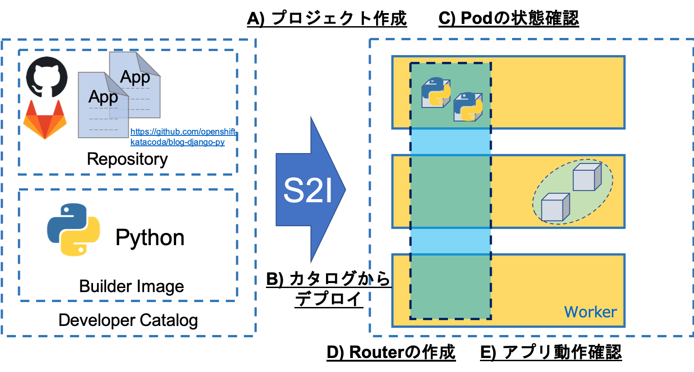

'''

== 1-2-1. 諸注意
=== 1-2-1-1. OpenShiftにおけるデプロイについて

OpenShiftでは、いくつかの方法でアプリケーションをクラスター上にデプロイすることができます。

* 既存のDockerイメージを使ってデプロイする方法
* ソースコードとS2I(ツール)を使ってビルド&デプロイする方法
* ソースコードとDockerfileを使ってビルド&デプロイする方法

本ハンズオンでは、ソースコードとS2I(ツール)で、ビルド＆デプロイを実施します。

=== 1-2-1-2. 事前準備

* OpenShiftクラスターへのアクセス情報

== 1-2-2. OpenShiftコンソールへのログイン

ブラウザ(Chrome or Firefox)でOpenShift Webコンソールにログインします。

OpenShift WebコンソールのRULは、etherpad OpenShift WebコンソールのURLを参照ください。

`userX` としてログインしましょう。パスワードはetherpadの OpenShiftユーザのパスワードを参照ください。
(etherpadで予約したuser1,user2などのIDです)

Webコンソールの基本操作やクラスター内コンポーネントの基本的な動作の確認を行いたい場合は、前のハンズオンlink:ocp4ws-ops-1-1.adoc[OpenShiftクラスターへのログインと動作確認(Lab1-1)]を実施してください。

== 1-2-3. コンテナイメージのビルドとデプロイ

S2I(Source-to-Image)というツールを使って以下の2つのコンポーネントからコンテナイメージを生成し、コンテナアプリケーションをデプロイします。

* *リポジトリURL* : GitHubなどソースコード格納場所
* *S2I Builder Image* : S2Iスクリプトが含まれているDockerイメージ

またOpenShiftは、カタログ機能(Developer Catalog)を備えています。JavaやPython、nginxなどのS2I Builder Imageをカタログ上で選択、あるいはカタログ上に追加でき、アプリケーションを簡単にOpenShift上にデプロイできます。

新規にProjectを作成し、サンプルのコードとPython用のS2I Builder Imageを使ってコンテナイメージを作成し、アプリケーションをOpenShift上にデプロイしてみましょう。

=== 1-2-3-1. Project(Namespace)の作成

OpenShift Webコンソールで各自のProjectを作成しましょう。

. Webコンソールを Developer Console に切り替えます。
+
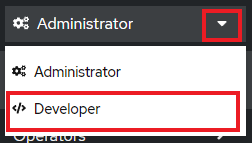

. [</> Developer] > [+Add] > [Project: プルダウンメニューを選択] > [Create Project] を選択します。
+
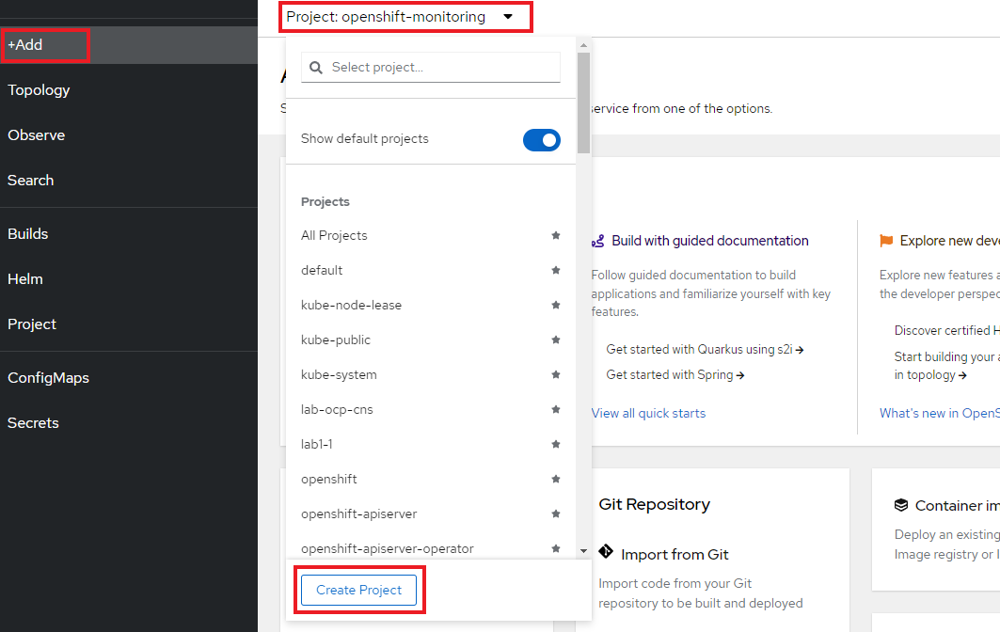

. Project名(例: `blog-userX` )を指定し、*Create* を選択します。
+
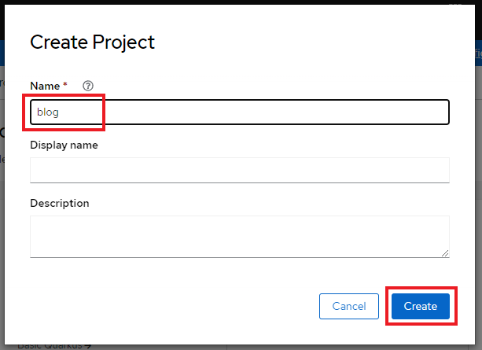
+
[TIPS]
====
NOTE: OpenShiftではProjectを作成することで、Projectと同じ名前のNamespaceが生成されます。NamespaceはK8sクラスターを論理的に分離させることが可能なK8sリソースの一種です。 +
例えば、アプリA用のNamespaceを``ns_appa``、アプリB用のNamespaceを``ns_appb``のように作成することで、同一のK8sクラスター内に存在する``ns_appa``と``ns_appb``が干渉しないように構成することも可能です。
====

---

=== 1-2-3-2. カタログでソースを指定してビルド&デプロイ

. [</> Developer] > [+Add] > [Developer Catalog] > [All services] を選択します。Projectには先ほど作成したProject(例: `blog-userX` )が指定されていることに注意してください。
+
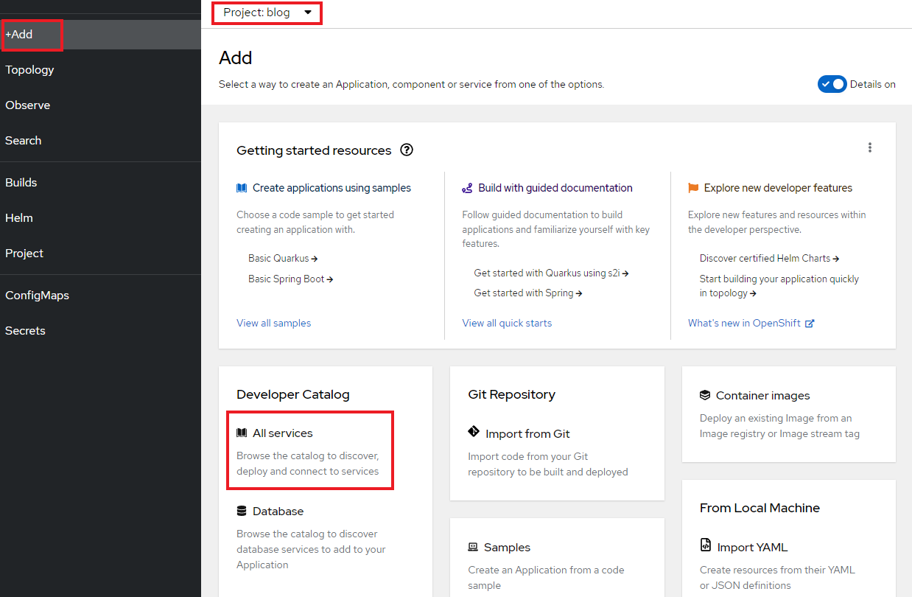

. 次に [Python] テンプレート を選択します。Developer Catalogの画面で、*Filter by keyword...* のボックスに *Python* と入力して探すと早いです。
+
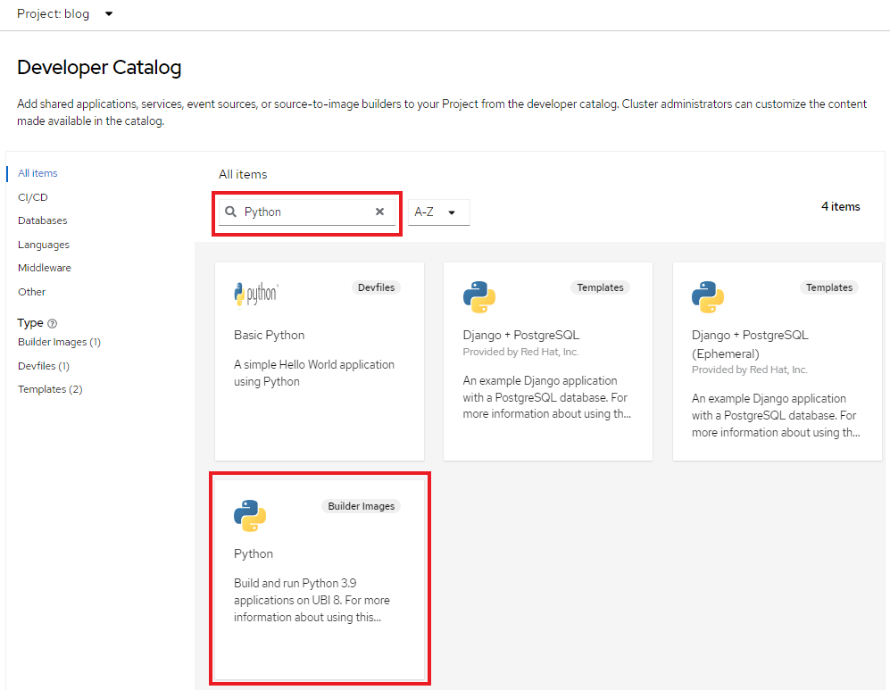
+
[TIPS]
====
NOTE: Developer CatalogからPythonアプリケーションを作成することで以下のリソースが作成されます。

* Build Config
 ** Gitリポジトリからソースコードをビルド
* Image Stream
 ** ビルド済イメージのトラッキング
* Deployment Config
 ** イメージ変更の際に新リビジョンにロールアウト
* Service
 ** クラスター内にワークロードを公開
* Route
 ** クラスター外にワークロードを公開
====

. アプリケーションのリポジトリなどを指定して、OpenShift上にアプリケーションをデプロイします。
+
最初に、*[Create Application]*　を選択します。 +
 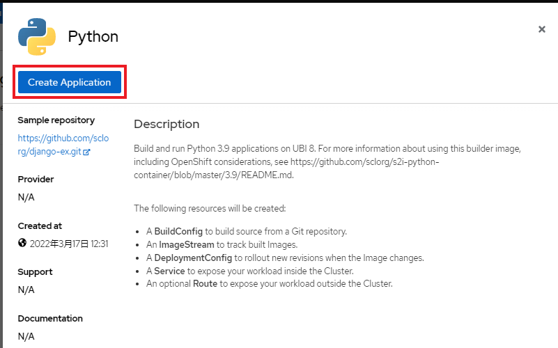
+
次に、*[リポジトリなどいくつかの項目]* を指定し、最後に *[Create]* を選択します。

 ** Builder Image Version: `3.9-ubi8`
 ** Git Repo URL: `+https://github.com/openshift-katacoda/blog-django-py+`
 ** Applicaiton Name:``任意の名前(例: blog)``
 ** Name:``任意の名前(例: blog)``
 ** Create route: `チェックを外す`
+
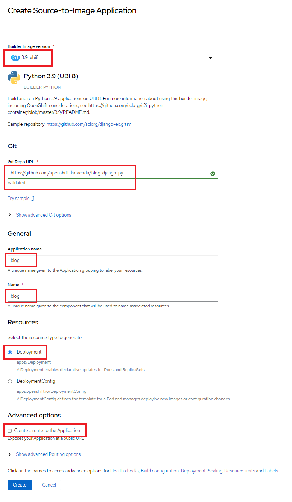
+
以上の手順で、blogアプリケーションをOpenShift上にデプロイできます。
+
[TIPS]
====
NOTE: [</> Developer] > [Topology] から、アプリケーションのアイコンをクリックすると、稼働状態を確認できます。ビルドおよびデプロイが完了するまでに少し時間がかかります。"Running" のステータスを確認できるまで待ちます。
====

---

=== 1-2-3-3. blogアプリケーションの状態を確認

. [</> Developer] > [Topology] \-> [アプリケーションのアイコン] から、Pod名のリンクをクリックします。
+
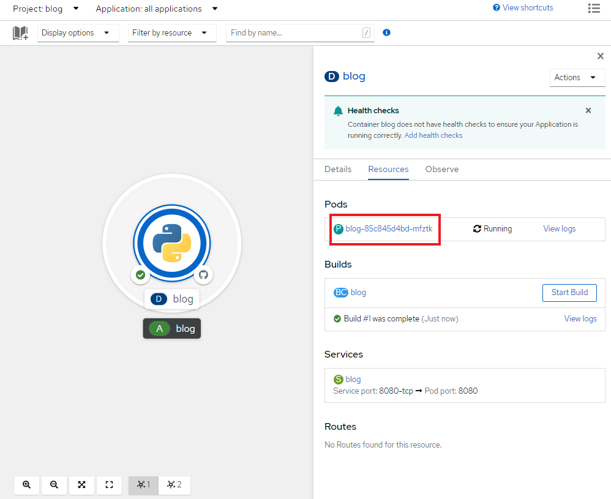
+
コンテナが作成され、起動していると[Metrics]タブでは以下のように表示されます。
+
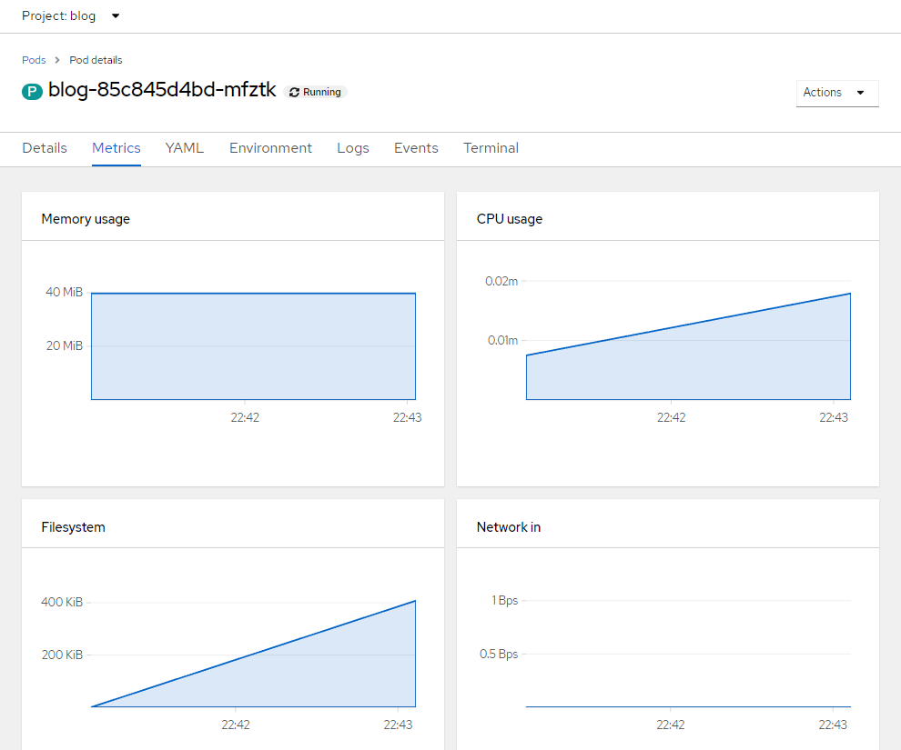
+
[TIPS]
====
NOTE: 前のLab1-1でProjectのリソース状況を確認した時と同じように、Prometheus(+Grafana)のモニタリング状況を確認したり、yaml定義の確認、Eventの確認などができます。 +
さらに、Pod内のコンテナ内でコマンド実行も行えます。下図のように [Terminal] を選択するとブラウザ上でターミナル内操作が行なえます。 +
また、Pod内に複数コンテナが存在する場合はプルダウンメニューで選択するだけでコンテナを切替えてターミナル操作が可能です。問題判別を行う際には、手間を省いてくれる意外と嬉しい機能です。

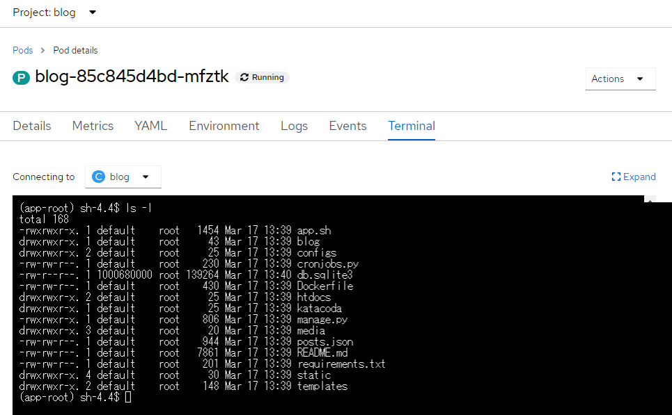
====

---

=== 1-2-3-4. 外部からアクセスするための Route を作成

現在のblogアプリケーションは、OpenShiftクラスター内に閉じた状態ですので、外部からアクセスできるように Route を作成しましょう。

. コンソールを Administation Console に切り替えます。
. [Administrator] > [Networking] > [Routes] > [Create Route] を選択します。選択しているProjectに注意してください。
+
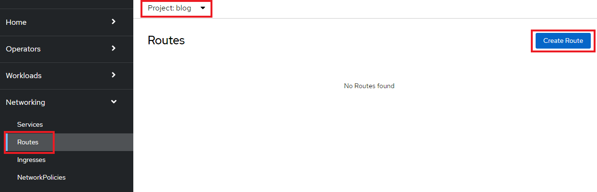

. *Name*、対象アプリ用の**Service**、*Port* を指定します。
 ** Name: `任意の名前 (例: blog)`
 ** Service: `指定済のアプリ名 (例: blog)`
 ** Target Port: `8080 → 8080(TCP)`

+
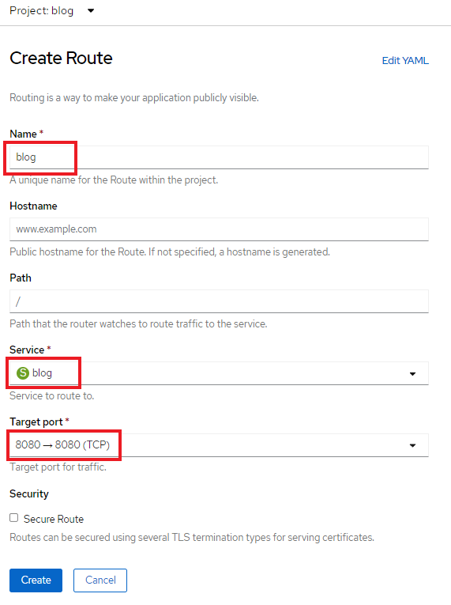
+

[TIPS]
====
NOTE: 「あれ？Service作ったっけ？」と思われた方、その感覚は正しいです。明示的には作成していません。 +
今回は 1-2-3-2. の手順で、Pythonテンプレートでblogアプリケーションをデプロイした際に、Podだけでなく、"Service" も同時に作成されています。
その際、Service名はアプリ名と同じ名前が指定されています。 +
Developer Catalogで選択したテンプレートは、Kubernetes上でアプリを動作させるために必ず必要になるリソース(PodやServiceなど)や、便利にアプリケーションを管理できるようにするための仕組みを一挙に作成できるように用意されています。
====

. 最後に *Create* を選択します。
+

[TIPS]
====
NOTE: 作成したRouteを参照する場合は、[Administrator] > [Networking] > [Routes] > [Router名] のように辿ることで確認できます。

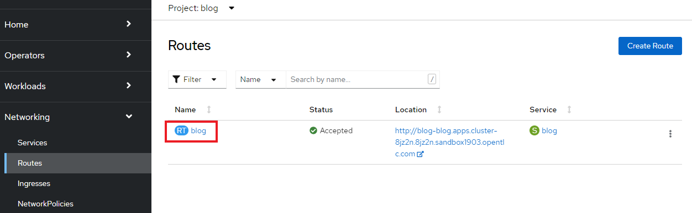

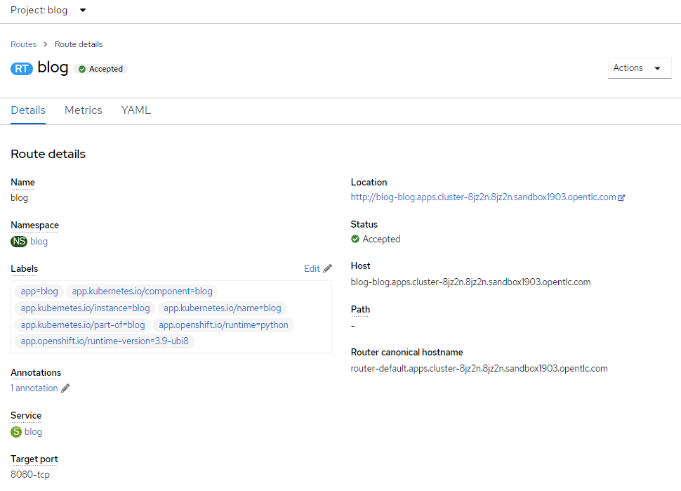
====

---

=== 1-2-3-5. アプリケーションの動作確認

. [Networking] > [Routes] を選択し、blog用のRoute(例: `blog-userX`)の行にある *Location欄のリンク* を開きます。
 例) `+	
http://blog-blog.apps.cluster-8jz2n.8jz2n.sandbox1903.opentlc.com+`
+
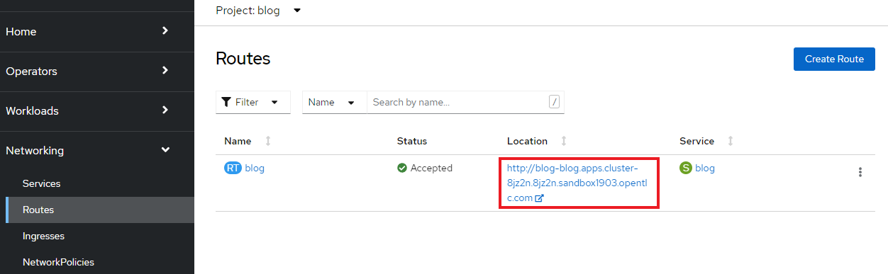

. blogアプリのサンプルページに自身のPod名が表示されていることを確認します。
+
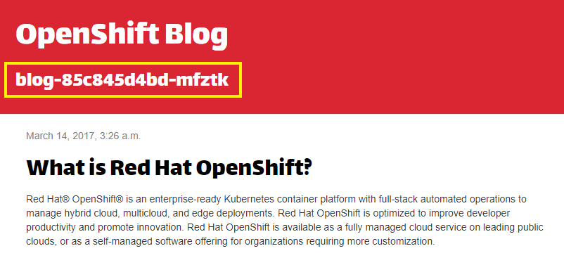
+
Pod名が分からない場合は、[Workloads] > [Pods] のPod一覧から確認しましょう。
+
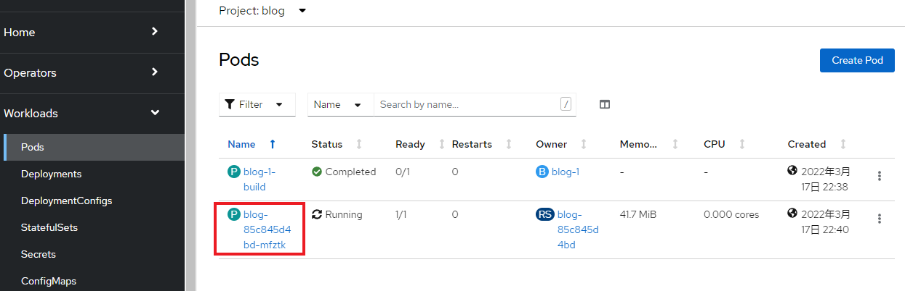

== 1-2-4. [練習問題] OpenShiftクラスターに他アプリケーションをデプロイ

お題:

「*OpenShiftクラスターに他アプリケーションをS2Iでビルド&デプロイしてみよう*」

コンテンツ:

* Project名(NameSpace): `trial-userX` (例: `trial-userX`)
* BaseImage(BuilderImage): `Python 3.9-ubi8`
* Git Repository: `+https://github.com/sclorg/django-ex+`
* Routes名: `trial`

'''

以上で、コンテナイメージのビルドとデプロイ は完了です。
次に link:ocp4ws-ops-1-3.adoc[Lab1-3: Prometheus JMX Exporterの展開] のハンズオンに進みます。
