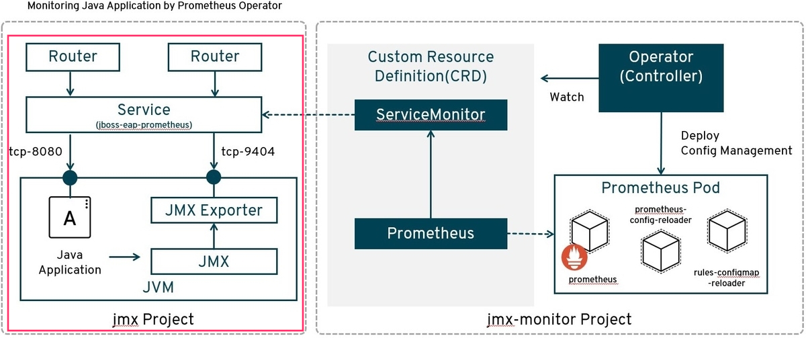
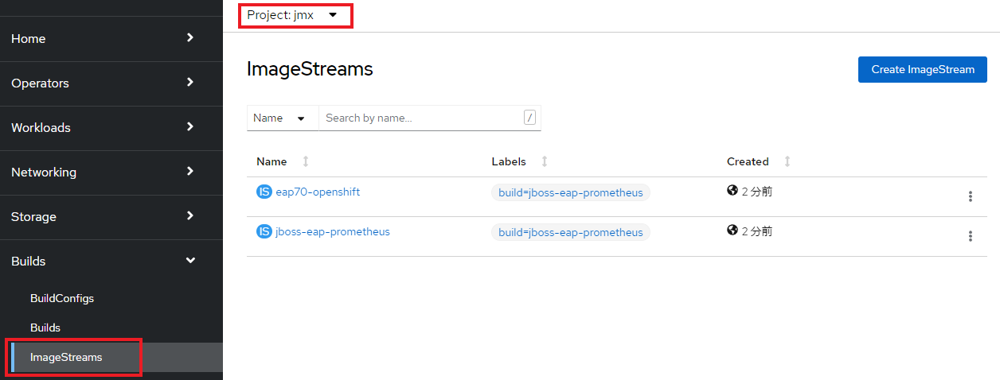
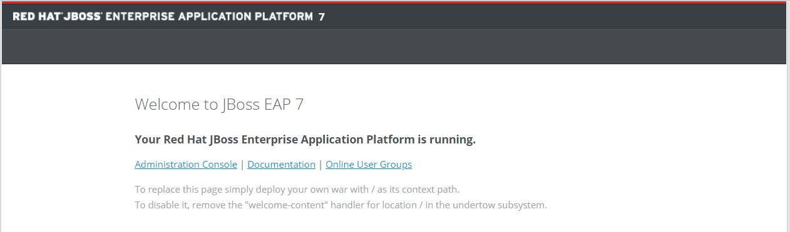

ifdef::env-github[]
:tip-caption: :bulb:
:note-caption: :information_source:
:important-caption: :heavy_exclamation_mark:
:caution-caption: :fire:
:warning-caption: :warning:
endif::[]

= Lab 1-3: Prometheus JMX Exporterの展開

== 1-3-1. Labで扱うアプリケーション構成
Lab 1-3 〜 1-5 では、オープンソースの監視ツールである"Prometheus"を扱います。 +
このLab 1-3では、監視対象となるJBoss EAPのJavaアプリケーションをデプロイした後、PrometheusのJMX(Java Management Extensions) Exporterを使ってこのアプリケーションのメトリクスデータを公開します。 +
後続するLab 1-4, 1-5で、Prometheus OperatorでPrometheusをデプロイし、JMXメトリクスデータを可視化します。 +

=== JMX Exporterは2つの動作を提供します。

- Java Agent +
Java Agent 用 JAR ファイルからメトリクスを収集 +
- HTTP server +
リモートの JMX ターゲットからメトリクスを取得しHTTPで公開

== 1-3-2. 監視対象となるJavaアプリケーションのデプロイ

=== OpenShiftコンソールへのログイン

ブラウザ(Chrome or Firefox)でOpenShift Webコンソールにログインします。

OpenShift WebコンソールのRULは、etherpad OpenShift WebコンソールのURLを参照ください。

`userX` としてログインしましょう。パスワードはetherpadの OpenShiftユーザのパスワードを参照ください。
(etherpadで予約したuser1,user2などのIDです)

Webコンソールの基本操作やクラスター内コンポーネントの基本的な動作の確認を行いたい場合は、前のハンズオンlink:ocp4ws-ops-1-1.adoc[OpenShiftクラスターへのログインと動作確認(Lab1-1)]を実施してください。

=== Javaアプリケーションのビルド

==== 1. Project作成

監視アプリケーション用の"userX-jmx-monitor"という名前のProjectを作ります。 +

[source,bash,role="execute"]
----
## Attention: ご自身のユーザー名を入力ください。
$ export TUTORIAL_USERNAME=userX

$ export TUTORIAL_MONITOR_NAMESPACE=${TUTORIAL_USERNAME}-jmx-monitor

$ oc new-project ${TUTORIAL_MONITOR_NAMESPACE}
Now using project "user1-jmx-monitor" on server "https://api.cluster-3adc.3adc.sandbox691.opentlc.com:6443".

You can add applications to this project with the 'new-app' command. For example, try:

    oc new-app rails-postgresql-example

to build a new example application in Ruby. Or use kubectl to deploy a simple Kubernetes application:

    kubectl create deployment hello-node --image=k8s.gcr.io/e2e-test-images/agnhost:2.33 -- /agnhost serve-hostname

$ oc project
Using project "user1-jmx-monitor" on server "https://api.cluster-8a39.8a39.sandbox135.opentlc.com:6443".
----

NOTE: 以降の作業は全て"userX-jmx-monitor"Projectで行います。 +

通常は``oc new-project``コマンドでProjectを作成すると、自動的に作成したProjectが指定されます。``oc project``コマンドで現在指定しているProjectが"userX-jmx-monitor"であることを確認して下さい。 +

==== 2. イメージビルド

アプリケーションをリポジトリからCloneして、「jboss-eap-prometheus」イメージをビルドします。 +

[source,bash,role="execute"]
----
$ cd ~/

$ git clone https://github.com/openlab-red/jboss-eap-prometheus
Cloning into 'jboss-eap-prometheus'...
remote: Enumerating objects: 43, done.
remote: Total 43 (delta 0), reused 0 (delta 0), pack-reused 43
Unpacking objects: 100% (43/43), done.

$ cd ./jboss-eap-prometheus/

$ oc new-build .
--> Found container image b72b49b (3 years old) from registry.access.redhat.com for "registry.access.redhat.com/jboss-eap-7/eap70-openshift:latest"

...(中略)

--> Creating resources with label build=jboss-eap-prometheus ...
    imagestream.image.openshift.io "eap70-openshift" created
    imagestream.image.openshift.io "jboss-eap-prometheus" created
    buildconfig.build.openshift.io "jboss-eap-prometheus" created
--> Success
----

==== 3. ビルドの確認

イメージビルドの状況をocコマンドで確認します。 +

[source,bash,role="execute"]
----
$ oc logs -f bc/jboss-eap-prometheus
Cloning "https://github.com/openlab-red/jboss-eap-prometheus" ...

...(中略)

Writing manifest to image destination
Storing signatures
Push successful
 ## イメージがPushされると自動的にログから開放されます。ログの完了を待ってください。
 ## もし「Errorとなってしまった場合は」、[Ctl] + [C]で出て再度やり直す

$ oc get build
NAME                     TYPE     FROM          STATUS     STARTED              DURATION
jboss-eap-prometheus-1   Docker   Git@23160b8   Complete   About a minute ago   47s

$ oc get imagestream
NAME                   IMAGE REPOSITORY                                                            TAGS
  UPDATED
eap70-openshift        image-registry.openshift-image-registry.svc:5000/userX-jmx/eap70-openshift        latest
  About a minute ago
jboss-eap-prometheus   image-registry.openshift-image-registry.svc:5000/userX-jmx/jboss-eap-prometheus   latest
  56 seconds ago
----
NOTE: 新しくイメージをPullするため、ビルドには少し時間がかかります。 +

イメージビルドの状況をOpenShiftポータルから確認します。 +
OpenShiftコンソールでは、ポータルの[Administrator]パースペクティブから[Builds]>[Image Streams]に遷移し、ビルドしたイメージがImageStreamに登録されていることを確認します。 +
Projectは `userX-jmx-monitor` を選択することを忘れないようにしておきましょう。 +

=== Javaアプリケーションのデプロイ

==== 1. Javaアプリケーションの展開

ここでは、先程ビルドしたした「jboss-eap-prometheus」を利用して、アプリケーションを展開します。 +
デプロイでは、Java Agent用JARファイルやJMX Exporter設定ファイルのパスを環境変数(jmx-prometheus.jar=9404)で指定します。 +

[source,bash,role="execute"]
----
$ export JBOSS_HOME=/opt/eap

$ oc new-app -i jboss-eap-prometheus:latest \
  --name=jboss-eap-prometheus \
  -e PREPEND_JAVA_OPTS="-javaagent:${JBOSS_HOME}/prometheus/jmx-prometheus.jar=9404:${JBOSS_HOME}/prometheus/config.yaml"

--> Found image add9eb8 (14 minutes old) in image stream "jmx/jboss-eap-prometheus" under tag "latest" for "jboss-eap-prometheus:latest"

...(中略)

--> Success
    Application is not exposed. You can expose services to the outside world by executing one or more of the commands below:
     'oc expose svc/jboss-eap-prometheus'
    Run 'oc status' to view your app.
----

TIP: 必要に応じてJavaアプリケーションにAnnotationを付与することも可能です。 +

[source,bash,role="execute"]
----
$ oc annotate svc/jboss-eap-prometheus prometheus.io/scrape='true'

$ oc annotate svc/jboss-eap-prometheus prometheus.io/port='9404'

$ oc get svc jboss-eap-prometheus -o jsonpath='{.metadata.annotations}' |jq
{
  "openshift.io/generated-by": "OpenShiftNewApp",
  "prometheus.io/port": "9404",
  "prometheus.io/scrape": "true"
}
----

==== 2. 展開したJavaアプリケーションの確認 +

この時点で「jboss-eap-prometheus-1」がRunning状態になれば、デプロイ成功です。 +
JMX Exporter はデフォルトで9404ポートを公開しています。 +

[source,bash,role="execute"]
----
$ oc get svc jboss-eap-prometheus
NAME                   TYPE        CLUSTER-IP       EXTERNAL-IP   PORT(S)                               AGE
jboss-eap-prometheus   ClusterIP   172.30.187.179   <none>        8080/TCP,8443/TCP,8778/TCP,9404/TCP   46s

$ oc get dc jboss-eap-prometheus
NAME                   READY   UP-TO-DATE   AVAILABLE   AGE
jboss-eap-prometheus   1/1     1            1           52s

$ oc get pod
NAME                                   READY   STATUS      RESTARTS   AGE
jboss-eap-prometheus-1-build           0/1     Completed   0          111s
jboss-eap-prometheus-b8fccc765-jplx2   1/1     Running     0          57s
----

「jboss-eap-prometheus-b8fccc765-jplx2」(b8fccc765-jplx2はランダムに生成)がRunning状態になるまで待ちましょう。 +

=== JavaアプリケーションのRoute設定

==== 1. JavaアプリケーションのRouter接続

次に「jboss-eap-prometheus」のアプリケーション(tcp-8080)ポートを、Routerに接続します。 +

[source,bash,role="execute"]
----
$ oc expose svc/jboss-eap-prometheus --name=tcp-8080 --port=8080
route.route.openshift.io/tcp-8080 exposed

$ oc get route tcp-8080
NAME       HOST/PORT                                                    PATH   SERVICES               PORT   TERMINATION   WILDCARD
tcp-8080   tcp-8080-user1-jmx-monitor.apps.cluster-3adc.3adc.sandbox691.opentlc.com          jboss-eap-prometheus   8080                 None
----

``oc get route``コマンドの出力の、``HOST/PORT``のカラムに表示されるURLにブラウザからアクセスすると、アプリケーションコンテンツが確認できます。 +
次のコマンドの出力で表示されるURLにブラウザでアクセスしてみましょう。JBoss EAPのインフォーメーション画面が表示されれば成功です。 +

[source,bash,role="execute"]
----
$ echo http://$(oc get route tcp-8080 -ojsonpath='{.spec.host}')
----

==== 2. Prometheus ExporterのRouter接続

先程と同様に「jboss-eap-prometheus」のPromtheus Exporter(tcp-9404)ポートを、Routerに接続します。 +

----
$ oc expose svc/jboss-eap-prometheus --name=tcp-9404 --port=9404
route.route.openshift.io/tcp-9404 exposed

$ oc get route tcp-9404
NAME       HOST/PORT                                                    PATH   SERVICES               PORT   TERMINATION   WILDCARD
tcp-9404   tcp-9404-user3-jmx.apps.cluster-3adc.3adc.sandbox691.opentlc.com          jboss-eap-prometheus   9404                 None
----
再度``HOST/PORT``のカラムに表示されるURLにブラウザからアクセスしてみましょう。 +

[source,bash,role="execute"]
----
$ echo http://$(oc get route tcp-9404 -ojsonpath='{.spec.host}')
----

==== 3. JMX Exporterの確認を行います。 +

PromSQLのクエリが確認できれば成功です。

NOTE: ExporterがJVMから情報を集めるため少し時間がかかります。 +

image::images/ocp4ws-ops/jboss-eap-prometheus-9404.jpg[Jboss Application]

これで、JMX Exporterの設定は完了です。 +
次にlink:ocp4ws-ops-1-4.adoc[Prometheus Operator]の設定作業に進みます。 +
