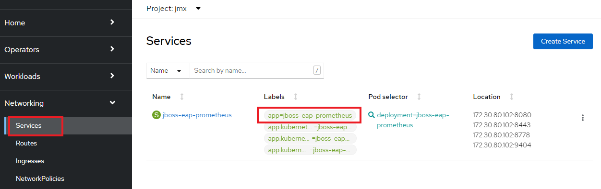
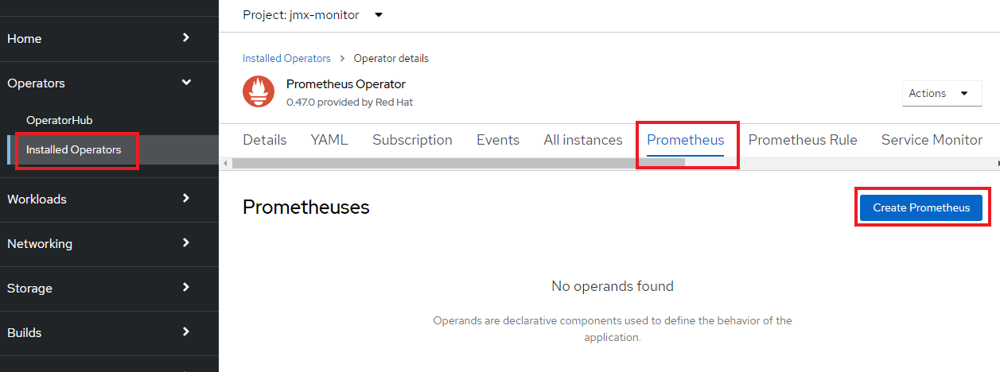
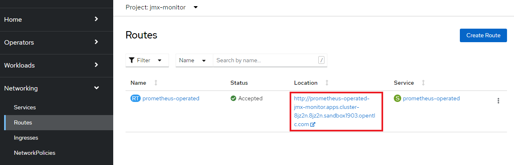
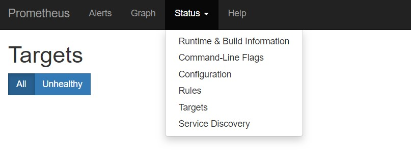
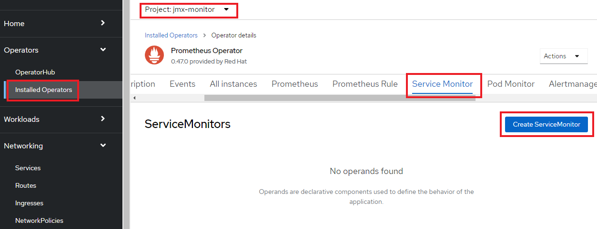
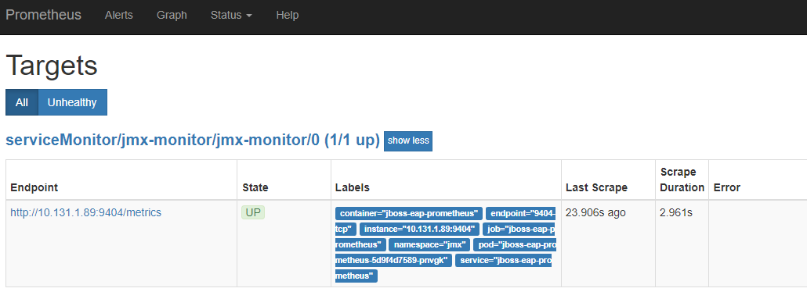
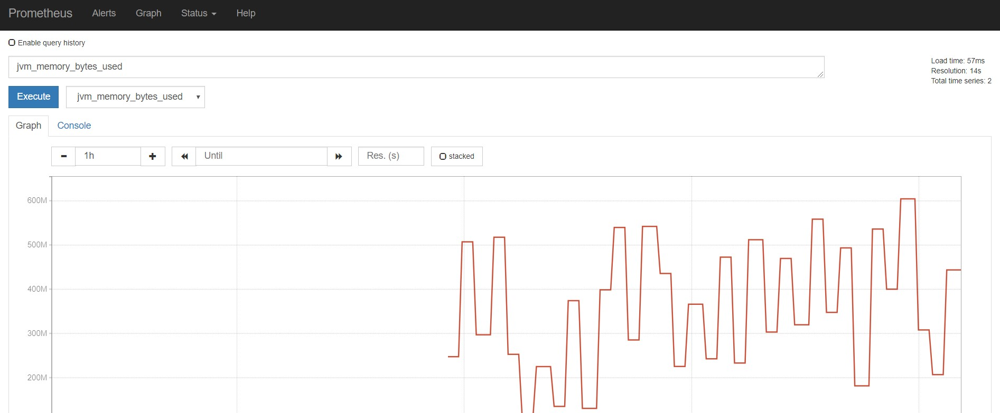

ifdef::env-github[]
:tip-caption: :bulb:
:note-caption: :information_source:
:important-caption: :heavy_exclamation_mark:
:caution-caption: :fire:
:warning-caption: :warning:
endif::[]

= Lab1-5: Custom Resourceの設定

== 1-5-1. Labの手順

=== Prometheus OperatorのCRの設定

Serviceの可視化設定をするときは、以下の手順で設定を行います。

. **Custome Resource(CR)**の"Prometheus"を設定する
. PrometheusのDashboardを確認する
. **Custome Resource(CR)**の"Service Monitor"を設定する
. PrometheusのJVM監視を確認する

NOTE: Prometheus OpearatorのCRDはAPIドキュメントを参考にしましょう。 +
https://github.com/coreos/prometheus-operator/blob/master/Documentation/api.md

=== 事前準備

* OpenShiftのOperatorCatalogからPrometheus Opearatorをデプロイしておく。
* 事前にJMX Exporterを用意しておく。 +
"userX-jmx-monitor"Projectに作成されている、JMX Prometheus ExporterのService "jboss-eap-prometheus"に、``app=jboss-eap-prometheus``というlabelが付けられていることを確認しておきましょう。  +
Webコンソールで、[Administrator]パースペクティブの[Networking]>[Services]からlabelは確認できます。 +

== 1-5-2. Custom Resource(CR) の設定

=== "Prometheus" CRを作成

==== 1. Prometheus CRの設定確認
"Prometheus" CRの作成には、以下のような項目を設定します。

|===
| Field | Description | Scheme | Required

| replicas
| Number of instances to deploy for a Prometheus deployment.
| *int32
| false

| version
| Version of Prometheus to be deployed.
| string
| false

| serviceAccountName
| ServiceAccountName is the name of the ServiceAccount to use to run the Prometheus Pods.
| string
| false

| securityContext
| SecurityContext holds pod-level security attributes and common container settings. This defaults to the default PodSecurityContext.
| *v1.PodSecurityContext
| false

| serviceMonitorSelector
| ServiceMonitors to be selected for target discovery.
| *https://kubernetes.io/docs/reference/generated/kubernetes-api/v1.11/#labelselector-v1-meta[metav1.LabelSelector]
| false

| logLevel
| Log level for Prometheus to be configured with.
| string
| false

| logFormat
| Log format for Prometheus to be configured with.
| string
| false

| scrapeInterval
| Interval between consecutive scrapes.
| string
| false

| ruleSelector
| A selector to select which PrometheusRules to mount for loading alerting rules from. Until (excluding) Prometheus Operator v0.24.0 Prometheus Operator will migrate any legacy rule ConfigMaps to PrometheusRule custom resources selected by RuleSelector. Make sure it does not match any config maps that you do not want to be migrated.
| *https://kubernetes.io/docs/reference/generated/kubernetes-api/v1.11/#labelselector-v1-meta[metav1.LabelSelector]
| false

| query
| QuerySpec defines the query command line flags when starting Prometheus.
| *https://github.com/coreos/prometheus-operator/blob/master/Documentation/api.md#queryspec[QuerySpec]
| false

| alerting
| Define details regarding alerting.
| *https://github.com/coreos/prometheus-operator/blob/master/Documentation/api.md#alertingspec[AlertingSpec]
| false

| rules
| /--rules.*/ command-line arguments.
| https://github.com/coreos/prometheus-operator/blob/master/Documentation/api.md#rules[Rules]
| false
|===

'''

==== 2. Prometheus CRの作成
作成したPrometheus Operatorを利用して、"Prometheus" CRを作成します。 +
Webコンソールで"userX-jmx-monitor"Projectを選択した状態で、[Operators]>[Intalled Operators]>[Prometheus Operator]を選択し、[Prometheus]タブの[Create Prometheus]をクリックします。 +

"Create Prometheus"の画面で、"Configure via:"に"YAML View"を選択すると、YAMLを記述するエディターが表示されます。 +
デフォルトで記入されている内容を全て削除し、以下のYAMLを記入してください。(コピー&ペーストで、userXの箇所だけ変更してください) +
この"Prometheus" CRでは、``key: k8s-app``のlabelを持つ"Service Monitor" CRを監視する設定をしています。"Service Monitor" CRはのちほど作成します。

[source,role="copypaste"]
----
apiVersion: monitoring.coreos.com/v1
kind: Prometheus
metadata:
  name: monitoring
  labels:
    prometheus: k8s
  namespace: userX-jmx-monitor
spec:
  replicas: 2
  serviceAccountName: prometheus-k8s
  securityContext: {}
  serviceMonitorSelector:
    matchExpressions:
      - key: k8s-app
        operator: Exists
  query:
    timeout: 300s
  alerting:
    alertmanagers:
      - namespace: userX-jmx-monitor
        name: alertmanager-main
        port: web
----

Webコンソールのエディターでは次のようになっていることを確認します。ここでも"userX-jmx-monitor"Projectが指定されているか注意して下さい。 +
確認ができたら、[Create]をクリックします。 +

==== 3. Prometheus Podの確認
"Prometheus" CRを作成すると、Prometheus Operatorが``replicas: 2``の数だけ、PrometheusのPodを起動します。  +
起動したPromethues Podを確認しておきましょう。

[source,bash,role="execute"]
----
$ oc get pod -l prometheus=monitoring
NAME                      READY   STATUS    RESTARTS   AGE
prometheus-monitoring-0   2/2     Running   0          89s
prometheus-monitoring-1   2/2     Running   0          89s
----

=== PrometheusのDashboardを確認

==== 1. PrometheusのRouter接続
PrometheusのDashboardを表示しましょう。Lab1-3.で行ったように、PrometheusのServiceに対してRouterを接続し、Routeを作成します。

[source,bash,role="execute"]
----
$ oc get svc
NAME                   TYPE        CLUSTER-IP      EXTERNAL-IP   PORT(S)                             
jboss-eap-prometheus   ClusterIP   172.30.227.60   <none>        8080/TCP,8443/TCP,8778/TCP,9404/TCP
prometheus-operated    ClusterIP   None            <none>        9090/TCP 

$ oc expose service prometheus-operated --name=prometheus-operated
route.route.openshift.io/prometheus-operated exposed

$ oc get route prometheus-operated
NAME                  HOST/PORT                                                                           PATH   SERVICES              PORT   TERMINATION   WILDCARD
prometheus-operated   prometheus-operated-user1-jmx-monitor.apps.cluster-cc8c.cc8c.example.opentlc.com          prometheus-operated   web                  None
----

==== 2. Prometheus Dashboard確認
Routeが確認できたら、``HOST/PORT``のカラムに表示されるURLにアクセスしてみましょう。 +
URLをブラウザにコピー&ペーストしてもよいですし、Webコンソールで[Administrator]パースペクティブにある[Networking]>[Route]から、作成されたRouteの"Location"に表示されているURLをクリックしても構いません。 +
Prometheusのdashboardが表示されると成功です。 +

なお、この時点では何も監視登録が設定されていないため、PrometheusのDashboardに接続できますが、[Status]>[Targets]には何も監視対象が表示されません。

=== "Service Monitor" CRを作成

==== 1. Service Monitor CRの設定確認
"Service Monitor" CRの作成では以下のような項目を設定し、監視対象を特定します。 +

|===
| Field | Description | Scheme | Required

| jobLabel
| The label to use to retrieve the job name from.
| string
| false

| targetLabels
| TargetLabels transfers labels on the Kubernetes Service onto the target.
| []string
| false

| podTargetLabels
| PodTargetLabels transfers labels on the Kubernetes Pod onto the target.
| []string
| false

| endpoints
| A list of endpoints allowed as part of this ServiceMonitor.
| []https://github.com/coreos/prometheus-operator/blob/master/Documentation/api.md#endpoint[Endpoint]
| true

| selector
| Selector to select Endpoints objects.
| https://kubernetes.io/docs/reference/generated/kubernetes-api/v1.11/#labelselector-v1-meta[metav1.LabelSelector]
| true

| namespaceSelector
| Selector to select which namespaces the Endpoints objects are discovered from.
| https://github.com/coreos/prometheus-operator/blob/master/Documentation/api.md#namespaceselector[NamespaceSelector]
| false

| sampleLimit
| SampleLimit defines per-scrape limit on number of scraped samples that will be accepted.
| uint64
| false
|===

==== 2. Service Motnitor CRの作成
最後に"Service Monitor" CRを作成して、JMXの値をPrometheusから取得して可視化します。  +
Webコンソールで"userX-jmx-monitor" Projectを選択した状態で、[Operators]>[Intalled Operators]>[Prometheus Operator]を選択し、[Service Monitor]タブの[Create Service Monitor]をクリックします。 +
この際、Projectが**"userX-jmx-monitor"**であることを確認します。 +

"Create Service Monitor"の画面で、"Configure via:"に"YAML View"を選択すると、YAMLを記述するエディターが表示されます。 +
デフォルトで記入されている内容を全て削除し、以下のYAMLを記入してください。(コピー&ペーストで、userXの箇所だけ変更してください) +

[source,role="copypaste"]
----
apiVersion: monitoring.coreos.com/v1
kind: ServiceMonitor
metadata:
  name: jmx-monitor
  labels:
    k8s-app: prometheus
  namespace: userX-jmx-monitor
spec:
  endpoints:
    - interval: 60s
      port: 9404-tcp
      scrapeTimeout: 55s
  selector:
    matchLabels:
      app: jboss-eap-prometheus
----

この"Service Monitor" CRは``k8s-app: prometheus``のlabelを持つため、先程作成した"Prometheus" CRの監視対象となります。 +
また、"jmx"Projectの``app: jboss-eap-prometheus``のlabelを持つアプリケーションをモニターするように設定しています。エンドポイントとして、Lab1-3.で設定したJMX Exporterのポート番号(TCP9404番)が指定されていることも確認してください。 +

==== 3. Prometheus監視項目確認
改めてPrometheusのDashboardに戻り、[Status]>[Targets]から、対象が表示されることを確認してみましょう。 +
Prometheusの設定が読み込まれ、出力表示が切り替わるまでに数分がかかりますので、何度か画面をリロードしてみて下さい。

Targetが正しく表示でき、StateがUP状態であれば、JMXの値も確認できます。[Graph]>[-insert metric at cursor-]から、「jvm_memory_bytes_used」など設定して[Execute]をクリックしてみましょう。 +
[Graph]のタブを押すと、可視化されたグラフが表示できます。

---
以上でPrometheus Operatorの基本利用は完了です。   +

NOTE: 同じ要領で、AlertManagerも設定してみましょう。   +
https://sysdig.com/blog/kubernetes-monitoring-prometheus-operator-part3/
